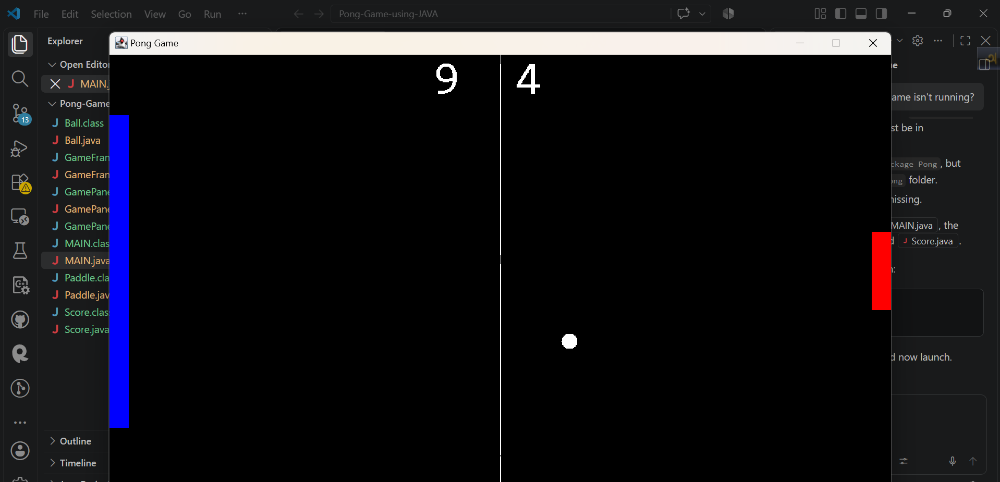

# Pong Game Using Java

A classic two-player Pong game built with Java Swing. Two players control paddles and compete to score points by getting the ball past their opponent's paddle.

## Screenshot

Add your screenshot here:

```md

```


## Features

- Two-player local gameplay
- Smooth real-time game loop
- Keyboard controls for both paddles
- Ball movement and bouncing
- Paddle collision detection
- Score tracking for both players
- Automatic paddle and ball reset after each point
- Resizable window disabled for a consistent game layout
- Built with Java Swing and AWT

## Controls

| Player | Move Up | Move Down |
| --- | --- | --- |
| Player 1 | `W` | `S` |
| Player 2 | `Up Arrow` | `Down Arrow` |

## Requirements

- Java Development Kit (JDK)
- Java version 8 or newer

## How to Run

Open a terminal in the project folder and compile the source files:

```powershell
javac *.java
```

Then start the game:

```powershell
java MAIN
```

## Project Files

- `MAIN.java` - Application entry point
- `GameFrame.java` - Creates the game window
- `GamePanel.java` - Runs the game loop and handles rendering and collisions
- `Ball.java` - Controls ball movement and direction
- `Paddle.java` - Controls paddle movement and drawing
- `Score.java` - Displays and stores player scores

## Gameplay

Player 1 uses the blue paddle on the left side. Player 2 uses the red paddle on the right side. When the ball passes a paddle, the opposing player earns a point and the ball and paddles are reset.
